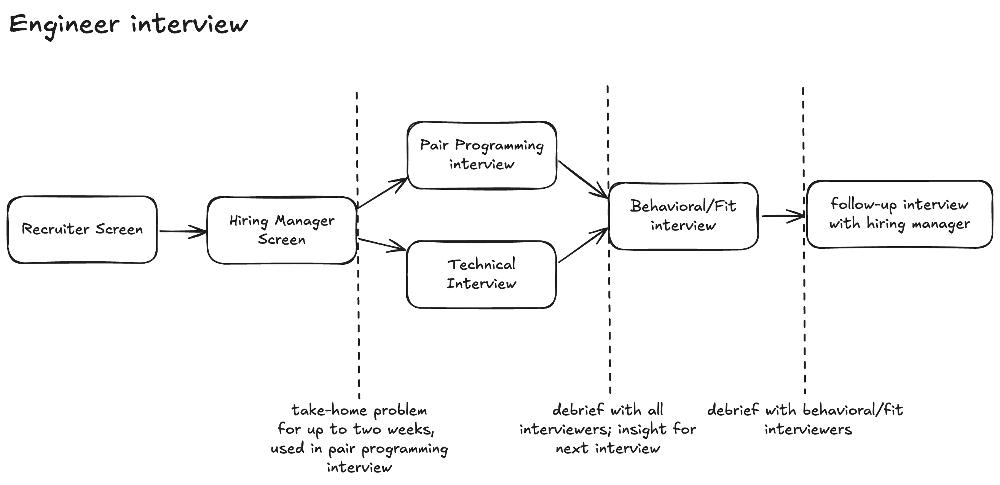

# Engineer Interview

## Recruiter Screen
Objectives:
1. Can they speak confidently about details in their resume and do they explain it is understandable terms?
2. Do some basic behavioral queston checks for what we need in this position.
3. Have the read the role description and anything about the company?

Outside of some basic checks, this time can be used to outline expectations for the interview.

## Hiring Manager Screen
Objectives:
1. Assess technical principles and familiarity with design patterns
2. What is their architecutural awarenesss both of patterns and how to reason about trade-offs
3. Ask them to teach you something about what they have recently learned to ensure they are curious

> If they are L4^, introduce the take-home assignment

## Pair Programming Interview

## Technical Interview

# Notes -- historical thinking

## Pair programming inteview approaches

I think that #3 yields the best, most consistent experience when you use a generic problem internal interviewers know well.

1. **Platforms like CoderPad, HackerRank, HackerEarth etc.**
* There can be limitations on the types of problems you can orchastrate and use of testing frameworks.
* The browser IDEs are nice but can be awkward for candidates.
* It can provide standardizaion across the organization and can require less work for recruiting efforts.
2. **Provide scaffolded project possibly with stub**
* This has a higher maintenence cost of this code and it can easily get out of date. This cost scales linearly with the amouunt of code written.
* You can have more flexibity on the style of problems you can use.
* You risk execution not working on a candidates machine or having issues.
* A limited scaffolding can cause more confusion for candidates about how to deal with mocks or stubs.
3. **Provide a prompt and some "homework"**
* The amount of "homework" can drive some inequity in the process because not everyone has the time to spend a bunch of time on a coding problem. 
* There is more coordination cost with the candidate and possible variability in the interview.
* This can enable a more realistic problem and lower maintenance cost of interview materials.
* This can weed out more senior developers who are not curious.