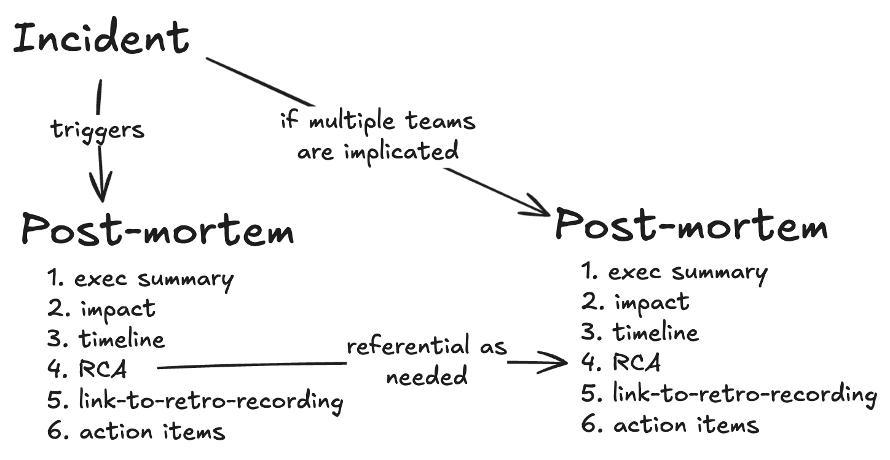

# Post Mortem Workflow

# Post Mortem Template 

time-of-detection:  
time-of-acknowledgement:  
time-of-recovery:   

## Executive Summary
*Write a summary of the incident that includes "what happenend", "measured impact" and "recovery". Brevity and precision is important.*

## Impact
*Explain the impact to customers, internal or external, using specific numbers or calculated estimates.*

## Timeline
*Write a timeline of events starting at detection. Capture any relevant events that might provide insight to root cause or be worth retropection. We want learn from this event log.*

`<date> - <CT time>: <Significant moment for detection, impact to customers, recovery, etc>`

## Root Cause Analysis
*Describe the root cause of the failure that affects this team's system. The heart of the issue could live with another team. Reference another post-mortem if an error occurs at an interface boundary.*

## Retrospective
*Run a 30min-1hr retrospective. Make sure to cover “what went well”, “what did not” and “where we got lucky”. Focus your discussion on a shared understanding of “what did not” and “where we got lucky" to generate action items. Make sure to include a link to the facilitation resources and recording*

## Action Items
*List out your action items from the retrospective. Links to story cards is preferable*