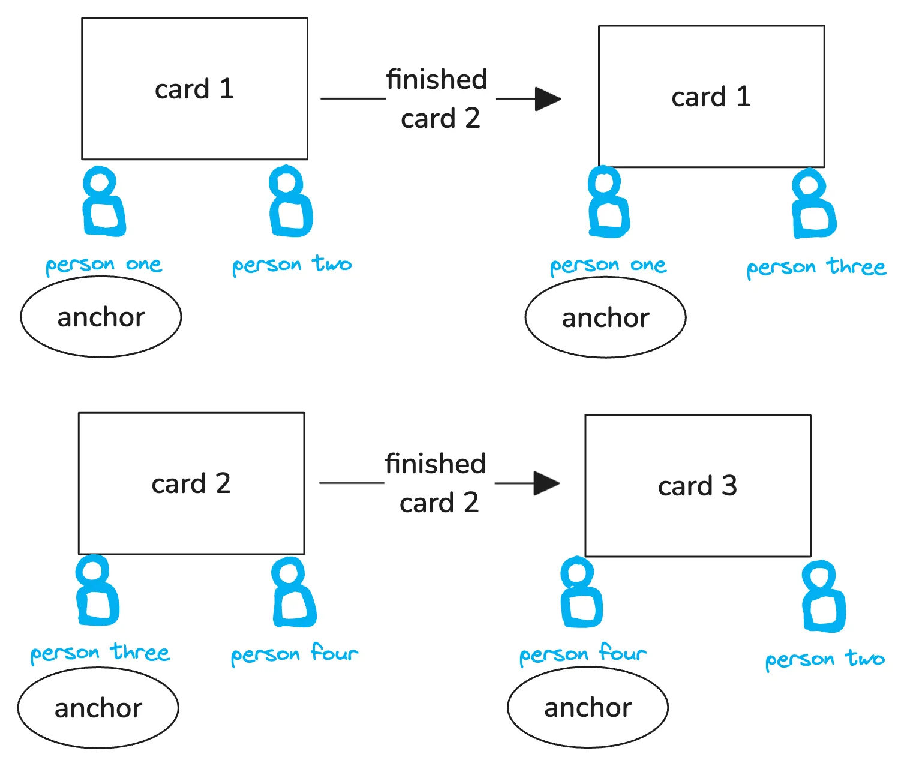

Pairing is a practice that should act as a force multiplier for team not a formality for work. To explore the facets of pairing read this [On Pair Programming](https://martinfowler.com/articles/on-pair-programming.html) 

I generally reduce it to this mental model pictured above. When one pair finishes a card, rotate non-anchors and create new anchors. In this example it could be **person four** or **person two**.

Pair rotations will feel painful if the anchor does not have enough context/skill to execute the card by themselves. Yes there is a transaction cost onboarding someone to your work, but over time, those transaction costs should be trivial when people are engaged and build enough of the right technical muscle.

Lastly, this is a default working modality. Discard when appropriate.